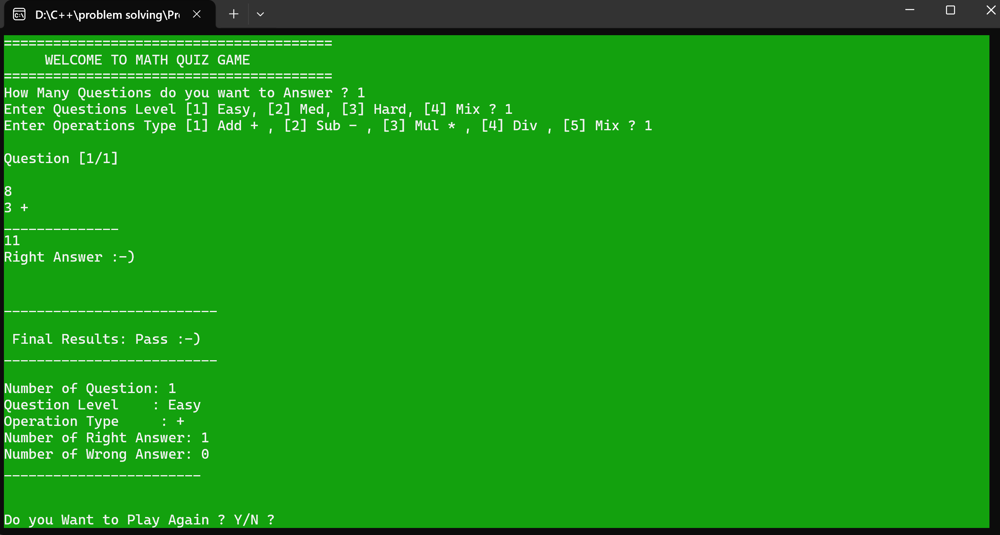
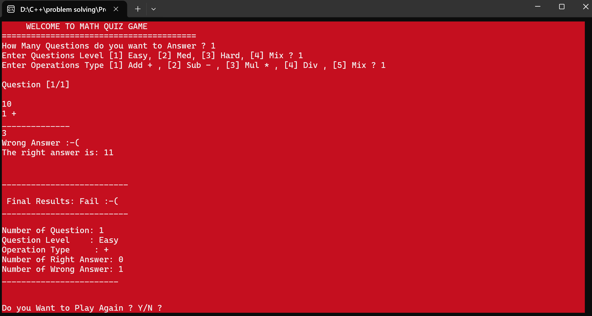

# 🧮 Math Quiz Game – C++ Console Application 🎮

Ein interaktives **C++ Konsolenprojekt**, das grundlegende und fortgeschrittene Programmierkonzepte demonstriert, mit Fokus auf **Struktur, Logik und sauberen, modularen Code**.

---

## **1️⃣ Ziel des Projekts**

Dieses Projekt wurde entwickelt, um zentrale Programmierkonzepte in **C++** praxisnah zu demonstrieren, darunter:

- Funktionen (Berechnung, Eingabe, Ausgabe)
- Enums (Fragelevel, Operationstypen)
- Structs (Fragen, Quiz-Informationen)
- Zufallszahlen mit `rand()`
- Schleifen zur Steuerung von Fragen und Runden
- Logik zur Bewertung von Antworten und Spielergebnissen

**Ziel:**  
Darstellung von **sauberem, strukturiertem und wiederverwendbarem Code**, der die Fähigkeiten des Entwicklers im Bereich der prozeduralen Programmierung verdeutlicht.

---

## **2️⃣ Projektbeschreibung**

- Der Spieler wählt:
  - Anzahl der Fragen
  - Schwierigkeitsgrad
  - Rechenoperation (Addition, Subtraktion, Multiplikation, Division oder Mix)
- Jede Frage wird dynamisch generiert.
- Der Spieler gibt seine Antwort ein, welche sofort überprüft wird.
- Jede Antwort wird visuell und akustisch bewertet:
  - 🟢 Grün = richtige Antwort
  - 🔴 Rot + Ton = falsche Antwort
- Am Ende des Quiz:
  - Zusammenfassung aller Fragen
  - Berechnung der Gesamtpunktzahl
  - Anzeige von **Pass / Fail**
- Der Spieler kann das Quiz erneut starten.

---

## **3️⃣ Funktionsübersicht / Funktionen**

| Funktion | Zweck |
|--------|------|
| `RandomNumber(int From, int To)` | Generiert eine Zufallszahl zwischen From und To |
| `SimpleCalculator(int Number1, int Number2, enOperationType OpType)` | Führt eine Rechenoperation aus |
| `GetRandomOperationType()` | Gibt einen zufälligen Operationstyp zurück |
| `GetOpTypeSymbol(enOperationType OpType)` | Gibt das Symbol der Operation zurück (+, -, *, /) |
| `GetQuestionLevelText(enQeustionsLevl QuestionsLevel)` | Gibt die Schwierigkeitsstufe als Text zurück |
| `GetFinalResultText(bool Pass)` | Gibt das Endergebnis als Text zurück |
| `ReadHoeManyQuestion()` | Liest die Anzahl der Fragen ein |
| `ReadQuestionsLevel()` | Liest den Schwierigkeitsgrad ein |
| `ReadOperationsType()` | Liest den gewünschten Operationstyp ein |
| `ReadQuestionAnswer()` | Liest die Antwort des Spielers |
| `ResetScreen()` | Setzt den Bildschirm zurück |
| `WelcomeGame()` | Zeigt die Willkommensnachricht |
| `SetScreenColor(bool Answer)` | Ändert die Bildschirmfarbe je nach Antwort |
| `PrintTheQuestion(stQuizz&, short)` | Zeigt eine Quizfrage an |
| `PrintQuizzResults(stQuizz)` | Zeigt das Endergebnis des Quiz |
| `GenerateQuestion(enQeustionsLevl, enOperationType)` | Generiert eine einzelne Frage |
| `GenerateQuizzQuestions(stQuizz&)` | Generiert alle Quizfragen |
| `CorrectTheQuestionAnswer(stQuizz&, short)` | Überprüft die Antwort und berechnet Punkte |
| `AskAndCorrectQuestionListAnswer(stQuizz&)` | Führt alle Fragen aus und wertet sie aus |
| `PlayMathGame()` | Kernlogik des Spiels |
| `StartGame()` | Steuerung des Spielablaufs inkl. Neustart |
| `main()` | Einstiegspunkt des Programms |

---
## **🔧 Verwendete Technologien**

- Programmiersprache: C++
- Entwicklungsumgebung: Visual Studio / Code::Blocks
- Paradigma: Prozedurale Programmierung
- Plattform: Windows (Konsole)


## **4️⃣ Code-Beispiel**

```cpp
enum enOperationType { Add=1, Sub=2, Mul=3, Div=4, Mix=5 };

// Dies ist nur ein Ausschnitt des Codes.
// Der vollständige Code befindet sich im Projektordner.

```
## **5️⃣ Spielausgabe / Screenshots**

Die Screenshots veranschaulichen den vollständigen Ablauf des Quiz-Spiels:

- Auswahl der Quizparameter (Anzahl der Fragen, Schwierigkeitsgrad, Operationstyp)
- Dynamisch generierte Rechenfragen
- Sofortiges visuelles und akustisches Feedback:
  - Richtig / Falsch
- Zusammenfassung der Ergebnisse am Ende des Quiz
- Anzeige des Gesamtergebnisses inklusive **Pass / Fail**




---

## **6️⃣ Herausforderungen & erworbene Fähigkeiten**

✅ Strukturierte und modulare Programmierung  
✅ Einsatz von Enums und Structs zur sauberen Datenmodellierung  
✅ Dynamische Generierung von Quizfragen mithilfe von Zufallszahlen  
✅ Logik zur korrekten Antwortprüfung und Punkteberechnung  
✅ Benutzerinteraktion mit visuellem (Farbwechsel) und akustischem Feedback  
✅ Saubere Trennung von Programm-Logik, Ein- und Ausgabe  
✅ Entwicklung eines vollständigen, lauffähigen und erweiterbaren Quiz-Systems  

---

## **7️⃣ Fazit**

Dieses Projekt demonstriert meine Fähigkeit, **strukturierte Konsolenanwendungen in C++** zu entwickeln, mit besonderem Fokus auf:

- Verständliche und nachvollziehbare Logik  
- Wiederverwendbaren und modularen Code  
- Saubere und übersichtliche Programmstruktur  


